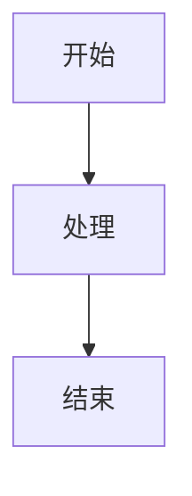

# 特殊语法块渲染功能

## 功能概述

这个功能实现了将Markdown中的特殊语法块（代码块、Mermaid图表、数学公式、提示框等）渲染为图片，并上传到GitHub，然后用图片链接替换原始语法块。这样可以提高跨平台兼容性，确保在不同的Markdown渲染器中都能正确显示。

## 支持的语法块类型

### 1. 代码块

```javascript
function hello() {
  console.log(`Hello, World!`)
}
```

### 2. Mermaid图表



### 3. 数学公式

```
$$
\int_{-\infty}^{\infty} e^{-x^2} dx = \sqrt{\pi}
$$
```

### 4. GitHub风格提示框

```
> [!NOTE]
> 这是一个提示信息

> [!WARNING]
> 这是一个警告信息

> [!TIP]
> 这是一个小贴士

> [!IMPORTANT]
> 这是重要信息

> [!CAUTION]
> 这是注意事项
```

## 使用方法

### 1. 启用功能

1. 打开右侧设置面板
2. 找到"特殊语法块渲染"面板
3. 开启"启用特殊语法块渲染"开关

### 2. 查看预览

- 在设置面板中可以看到当前文档中检测到的特殊语法块
- 每个语法块会显示类型和内容预览

### 3. 渲染过程

1. 当启用功能后，编辑器会自动检测特殊语法块
2. 在预览时，这些语法块会被渲染为图片
3. 图片会自动上传到GitHub
4. 原始语法块会被替换为图片链接

## 技术实现

### 核心组件

1. **BlockRenderer** (`src/utils/blockRenderer.ts`)

   - 负责将各种语法块渲染为图片
   - 使用html-to-image库生成图片
   - 支持主题样式应用

2. **MarkdownProcessor** (`src/utils/markdownProcessor.ts`)

   - 负责识别和处理Markdown中的特殊语法块
   - 管理渲染缓存
   - 提供预览功能

3. **BlockRenderingPanel** (`src/components/BlockRenderingPanel.vue`)
   - 用户界面组件
   - 显示当前文档中的特殊语法块
   - 提供开关控制

### 工作流程

1. **检测阶段**: 使用正则表达式识别特殊语法块
2. **渲染阶段**: 创建DOM元素并应用样式，然后转换为图片
3. **上传阶段**: 将图片上传到GitHub仓库
4. **构建触发**: 自动触发GitHub Pages构建
5. **验证阶段**: 等待并验证图片可访问性
6. **替换阶段**: 用图片链接替换原始语法块

### GitHub图床配置

#### 环境变量配置

可以通过以下环境变量配置GitHub图床：

- `VITE_GITHUB_IMAGE_REPO`: GitHub仓库名（如：zillionare/images）
- `VITE_GITHUB_IMAGE_BRANCH`: 分支名（如：main）
- `VITE_GITHUB_IMAGE_TOKEN`: GitHub访问令牌
- `VITE_GITHUB_IMAGE_BASE_PATH`: 存储路径模板（如：images/{year}/{month}/）
- `VITE_GITHUB_IMAGE_BASE_URL`: 访问基础URL（如：https://images.jieyu.ai）

#### 默认配置

如果未设置环境变量，将使用以下默认配置：

- 仓库：zillionare/images
- 分支：main
- Token：[从环境变量获取]
- 存储路径：images/{year}/{month}/
- 访问地址：https://images.jieyu.ai

#### 路径变量

存储路径支持以下变量：

- `{year}`: 当前年份（如：2024）
- `{month}`: 当前月份，两位数格式（如：06）

## 配置选项

- **启用/禁用**: 可以随时开启或关闭功能
- **主题适配**: 自动应用当前编辑器主题样式
- **缓存管理**: 相同内容的语法块会使用缓存，避免重复渲染

## 注意事项

1. **网络依赖**: 需要网络连接来上传图片到GitHub
2. **处理时间**: 首次渲染可能需要一些时间，GitHub Pages构建需要1-2分钟
3. **存储空间**: 图片会占用GitHub仓库空间
4. **兼容性**: 生成的图片在所有Markdown渲染器中都能正确显示
5. **访问延迟**: 图片上传后可能需要等待2分钟左右才能通过web访问
6. **Token安全**: 请妥善保管GitHub访问令牌，避免泄露

## 故障排除

### 常见问题

1. **渲染失败**

   - 检查网络连接
   - 确认GitHub配置正确
   - 查看浏览器控制台错误信息

2. **图片显示异常**

   - 确认图片链接有效
   - 检查GitHub仓库权限

3. **性能问题**
   - 大量语法块可能影响性能
   - 考虑分批处理或优化内容

## 开发说明

### 添加新的语法块类型

1. 在`BlockRenderer`中添加新的渲染方法
2. 在`MarkdownProcessor`中添加识别正则表达式
3. 更新UI组件以支持新类型

### 自定义样式

可以通过修改`BlockRenderer`中的样式配置来自定义渲染效果。

## 测试

运行测试脚本验证功能：

```bash
node test-functionality.js
```

测试文件：`test-block-rendering.md`包含了各种类型的语法块示例。
