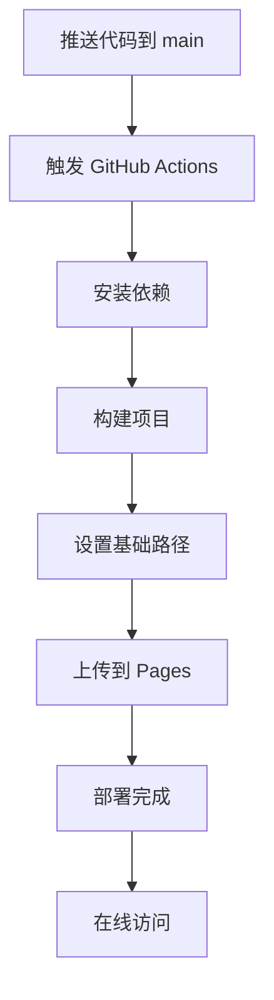

# GitHub Pages 部署配置

## 🚀 部署地址

您的 Markdown 编辑器将部署到：
**https://zillionare.github.io/marktwain**

## 📋 配置步骤

### 1. 启用 GitHub Pages

1. 进入您的 GitHub 仓库：https://github.com/zillionare/marktwain
2. 点击 **Settings** 标签
3. 在左侧菜单中找到 **Pages**
4. 在 **Source** 部分选择 **GitHub Actions**

### 2. 自动部署

配置完成后，每次推送到 `main` 分支时，GitHub Actions 会自动：

1. **构建项目**：
   - 安装依赖 (`npm ci`)
   - 构建生产版本 (`npm run build`)
   - 设置正确的基础路径 (`/marktwain/`)

2. **部署到 GitHub Pages**：
   - 上传构建产物到 Pages
   - 自动更新在线版本

### 3. 部署状态

您可以在以下位置查看部署状态：
- **Actions 标签**：https://github.com/zillionare/marktwain/actions
- **Deployments**：在仓库主页右侧的 "Deployments" 部分

## 🔧 技术配置

### GitHub Actions 工作流

文件：`.github/workflows/deploy.yml`

**主要配置**：
- **触发条件**：推送到 `main` 分支
- **Node.js 版本**：18
- **构建命令**：`npm run build`
- **基础路径**：`/marktwain/`
- **部署目标**：GitHub Pages

### Vite 配置

文件：`vite.config.ts`

**基础路径配置**：
```typescript
base: process.env.SERVER_ENV === `NETLIFY` 
  ? `/` 
  : process.env.VITE_BASE_URL || `/md/`,
```

**环境变量**：
- `VITE_BASE_URL=/marktwain/` (在 GitHub Actions 中设置)

## 🎯 功能特性

### 完整功能支持

在线版本将包含所有功能：
- ✅ **Markdown 编辑器**：实时预览和编辑
- ✅ **转图功能**：支持 admonition、代码块、数学公式转图
- ✅ **图床配置**：支持用户自定义 GitHub 图床
- ✅ **样式设置**：主题、字体、颜色等完整配置
- ✅ **导出功能**：支持多种格式导出
- ✅ **本地存储**：设置和内容自动保存

### 图床功能

**默认图床**：
- 使用 bucketio 作为默认图床
- 无需用户配置即可使用

**自定义图床**：
- 支持用户配置 GitHub 仓库作为图床
- 需要用户提供 GitHub Token 和仓库信息

## 🔍 部署验证

### 部署成功后验证

1. **访问在线地址**：https://zillionare.github.io/marktwain
2. **测试核心功能**：
   - 编辑 Markdown 内容
   - 实时预览效果
   - 转图功能
   - 设置保存

3. **检查资源加载**：
   - 样式文件正确加载
   - JavaScript 文件正确加载
   - 图标和字体正确显示

### 常见问题排查

**如果页面无法访问**：
1. 检查 GitHub Pages 是否已启用
2. 检查 Actions 是否运行成功
3. 检查基础路径配置是否正确

**如果资源加载失败**：
1. 检查浏览器控制台错误
2. 确认基础路径设置正确
3. 检查构建产物是否完整

## 📈 部署流程

### 自动部署流程



### 手动触发部署

如果需要手动触发部署：
1. 进入 **Actions** 标签
2. 选择 **Deploy to GitHub Pages** 工作流
3. 点击 **Run workflow**
4. 选择 `main` 分支并运行

## 🎉 完成

配置完成后，您的 Markdown 编辑器将：

1. **自动部署**：每次代码更新自动部署
2. **在线访问**：通过 https://zillionare.github.io/marktwain 访问
3. **功能完整**：包含所有本地开发的功能
4. **性能优化**：生产环境优化的构建版本

现在您的用户可以直接在线使用这个强大的 Markdown 编辑器，无需本地安装！🚀
