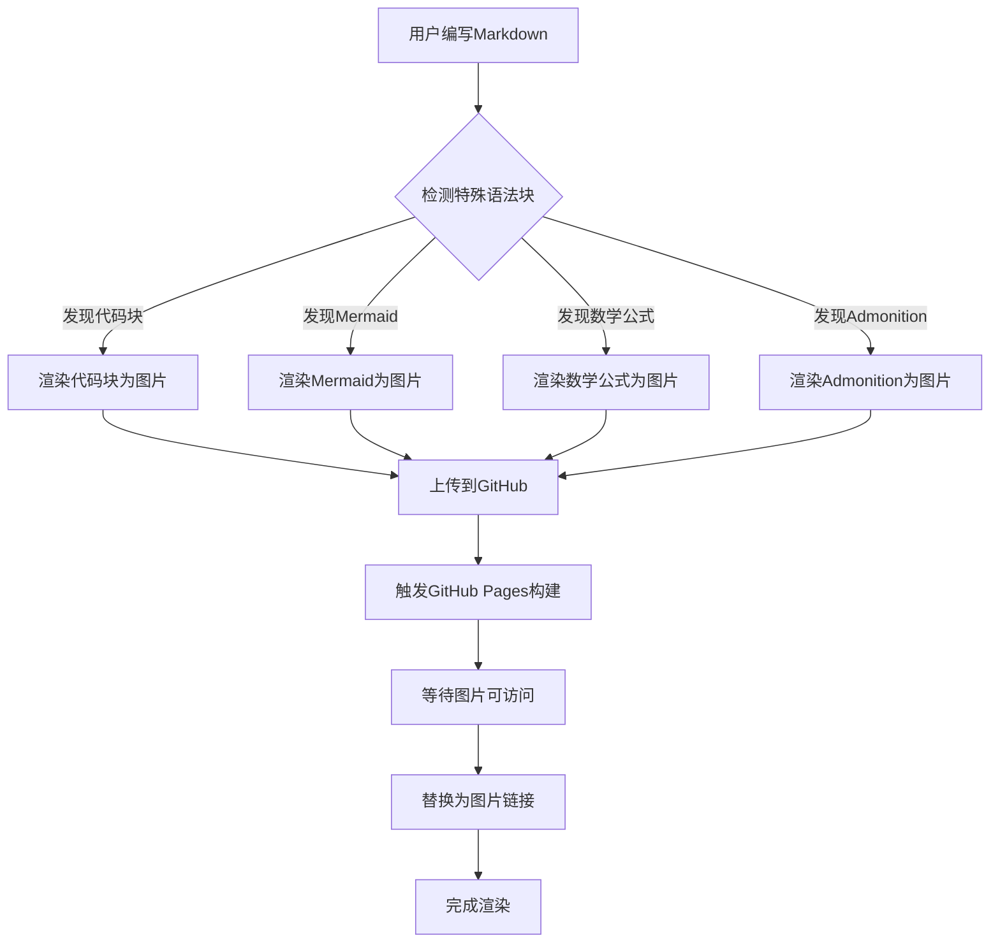

# GitHub图床功能测试文档

这个文档用于测试GitHub图床功能是否正常工作。

## 测试说明

当启用特殊语法块渲染功能后，以下内容将被转换为图片并上传到GitHub：

### 1. 代码块测试

```javascript
function testGitHubImageBed() {
  console.log(`Testing GitHub image bed functionality`)

  const config = {
    repo: `zillionare/images`,
    branch: `main`,
    basePath: `images/{year}/{month}/`,
    baseUrl: `https://images.jieyu.ai`
  }

  return config
}

// 调用测试函数
testGitHubImageBed()
```

### 2. Mermaid图表测试



### 3. 数学公式测试

$$
\begin{align}
\text{GitHub图床上传流程} &= \text{渲染} + \text{上传} + \text{验证} \\
\text{访问URL} &= \text{baseUrl} + \text{storagePath} \\
\text{存储路径} &= \text{images/}\{year\}/\{month\}/\text{filename}
\end{align}
$$

### 4. Admonition测试

> [!NOTE]
> 这是一个提示信息。当启用GitHub图床功能后，这个提示框将被渲染为图片并上传到zillionare/images仓库。

> [!WARNING]
> 请确保已正确配置GitHub访问令牌，否则图片上传将失败。

> [!TIP]
> 图片上传后可能需要等待1-2分钟才能通过https://images.jieyu.ai访问。

> [!IMPORTANT]
> 所有敏感信息（如GitHub token）都应通过环境变量配置，不要硬编码在代码中。

## 配置要求

### 环境变量

```bash
VITE_GITHUB_IMAGE_REPO=zillionare/images
VITE_GITHUB_IMAGE_BRANCH=main
VITE_GITHUB_IMAGE_TOKEN=your_github_token_here
VITE_GITHUB_IMAGE_BASE_PATH=images/{year}/{month}/
VITE_GITHUB_IMAGE_BASE_URL=https://images.jieyu.ai
```

### 默认配置

如果未设置环境变量，系统将使用以下默认配置：

- **仓库**: zillionare/images
- **分支**: main
- **存储路径**: images/{year}/{month}/
- **访问地址**: https://images.jieyu.ai
- **Token**: 需要通过环境变量设置

## 测试步骤

1. **配置环境变量**：设置GitHub访问令牌和其他配置
2. **启用功能**：在右侧面板中开启"特殊语法块渲染"
3. **编写内容**：在编辑器中输入包含特殊语法块的内容
4. **查看预览**：在预览窗口中查看渲染结果
5. **验证图片**：检查图片是否正确上传并可访问

## 预期结果

- ✅ 代码块被渲染为带语法高亮的图片
- ✅ Mermaid图表被渲染为SVG转PNG图片
- ✅ 数学公式被渲染为LaTeX格式图片
- ✅ Admonition块被渲染为带样式的提示框图片
- ✅ 所有图片都上传到GitHub并可通过https://images.jieyu.ai访问
- ✅ 原始语法块被替换为图片链接

## 故障排除

### 常见问题

1. **图片上传失败**

   - 检查GitHub token是否有效
   - 确认仓库权限设置正确
   - 查看浏览器控制台错误信息

2. **图片无法访问**

   - 等待1-2分钟让GitHub Pages构建完成
   - 检查GitHub Pages是否正确配置
   - 验证访问URL是否正确

3. **渲染质量问题**
   - 检查主题样式是否正确应用
   - 调整渲染参数（如分辨率、背景色等）
   - 确认字体和样式文件加载正常

---

**测试完成后，请验证所有特殊语法块都已正确转换为图片并可正常访问！** 🎉
