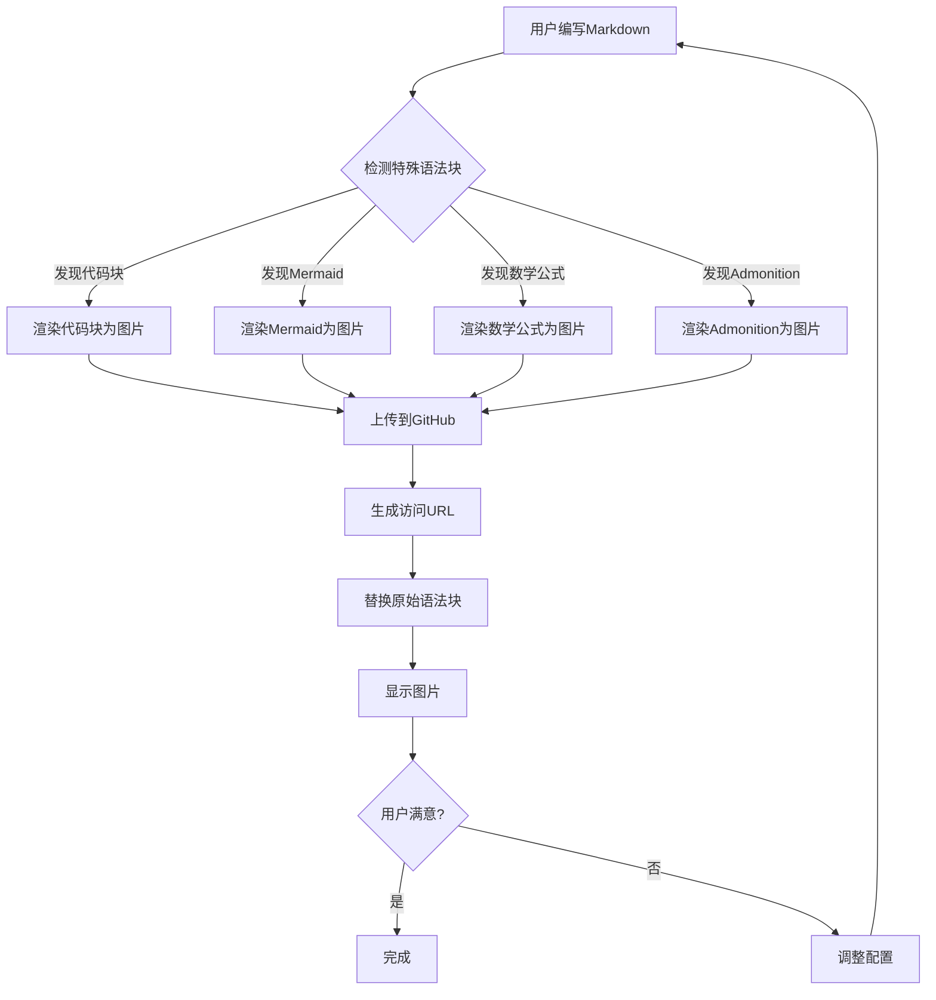

# 特殊语法块测试文档

这个文档用于测试GitHub图床功能是否正常工作。请按照以下步骤进行测试：

## 测试步骤

1. **配置GitHub Token**

   - 确保已设置正确的GitHub Personal Access Token
   - Token需要有 `repo` 或 `Contents: Write` 权限

2. **启用功能**

   - 在右侧面板中开启"特殊语法块渲染"功能
   - 点击"测试GitHub连接"确认配置正确

3. **测试转换**
   - 点击编辑器顶部工具栏的"转图"按钮
   - 等待系统处理，观察语法块是否被替换为图片
   - 再次点击按钮可切换回原始内容

## 测试用例

### 1. JavaScript代码块

```javascript
// GitHub图床功能测试
function testGitHubImageBed() {
  console.log(`Testing GitHub image bed functionality`)

  const config = {
    repo: `zillionare/images`,
    branch: `main`,
    basePath: `images/{year}/{month}/`,
    baseUrl: `https://images.jieyu.ai`
  }

  // 上传图片到GitHub
  uploadImageToGitHub(base64Content, filename, `test`)
    .then((url) => {
      console.log(`Upload successful:`, url)
    })
    .catch((error) => {
      console.error(`Upload failed:`, error)
    })

  return config
}

// 调用测试函数
testGitHubImageBed()
```

### 2. Python代码块

```python
# GitHub图床功能测试
import requests
import base64
from datetime import datetime

class GitHubImageBed:
    def __init__(self, repo, token):
        self.repo = repo
        self.token = token
        self.base_url = "https://api.github.com"

    def upload_image(self, content, filename):
        """上传图片到GitHub仓库"""
        url = f"{self.base_url}/repos/{self.repo}/contents/{filename}"

        headers = {
            'Authorization': f'Bearer {self.token}',
            'Accept': 'application/vnd.github.v3+json'
        }

        data = {
            'message': f'Upload image: {filename}',
            'content': content
        }

        response = requests.put(url, json=data, headers=headers)
        return response.json()

# 使用示例
image_bed = GitHubImageBed('zillionare/images', 'your_token_here')
result = image_bed.upload_image(base64_content, 'test.png')
print(f"Upload result: {result}")
```

### 3. Mermaid流程图



### 4. 数学公式

$$
\begin{align}
\text{GitHub图床上传流程} &= \text{检测} + \text{渲染} + \text{上传} + \text{替换} \\
\text{访问URL} &= \text{baseUrl} + \text{storagePath} \\
\text{存储路径} &= \text{images/}\{year\}/\{month\}/\text{filename} \\
\text{成功率} &= \frac{\text{成功上传数}}{\text{总尝试数}} \times 100\%
\end{align}
$$

### 5. GitHub风格提示框

> [!NOTE]
> 这是一个提示信息。当启用GitHub图床功能后，这个提示框将被渲染为图片并上传到zillionare/images仓库。图片将通过https://images.jieyu.ai域名访问。

> [!TIP]
> 💡 小贴士：图片上传后立即可用，无需等待GitHub Pages构建。系统会自动验证图片可访问性。

> [!WARNING]
> ⚠️ 警告：请确保您的GitHub Token有正确的权限。需要"repo"完整权限或"Contents: Write"权限才能成功上传图片。

> [!IMPORTANT]
> 🔥 重要：所有敏感信息（如GitHub token）都应通过环境变量配置，不要硬编码在代码中。

> [!CAUTION]
> 🚨 注意：大量的语法块可能会影响页面性能。建议适度使用此功能。

## 验证清单

测试完成后，请检查以下项目：

### 基本功能

- [ ] **转图按钮显示** - 启用功能后工具栏是否显示"转图"按钮
- [ ] **按钮状态切换** - 点击后按钮是否变为"原文"并高亮
- [ ] **内容切换** - 是否能正确在原文和图片模式间切换

### 转换质量

- [ ] **代码块转换** - JavaScript和Python代码块是否正确转换为带语法高亮的图片
- [ ] **Mermaid图表** - 流程图是否正确渲染为图片
- [ ] **数学公式** - LaTeX公式是否正确显示
- [ ] **提示框** - 所有类型的GitHub风格提示框是否正确渲染
- [ ] **图片质量** - 图片是否清晰，文字是否可读
- [ ] **主题适配** - 图片背景是否与当前主题匹配

### 性能测试

- [ ] **缓存机制** - 内容未变化时再次转图是否使用缓存（速度更快）
- [ ] **响应速度** - 手动转图是否比自动转图响应更快
- [ ] **链接有效** - 图片链接是否可以正常访问
- [ ] **控制台日志** - 浏览器控制台是否显示成功上传信息

## 故障排除

如果测试失败，请检查：

1. **GitHub Token权限**

   - 确认token有"repo"或"Contents: Write"权限
   - 使用"测试GitHub连接"功能验证

2. **网络连接**

   - 确认能访问api.github.com
   - 确认能访问images.jieyu.ai

3. **浏览器控制台**

   - 查看详细错误信息
   - 检查是否有权限或网络错误

4. **功能状态**
   - 确认右侧面板中功能已启用
   - 尝试刷新页面重新触发转换

---

**测试完成后，所有特殊语法块都应该被替换为正确的图片！** 🎉
