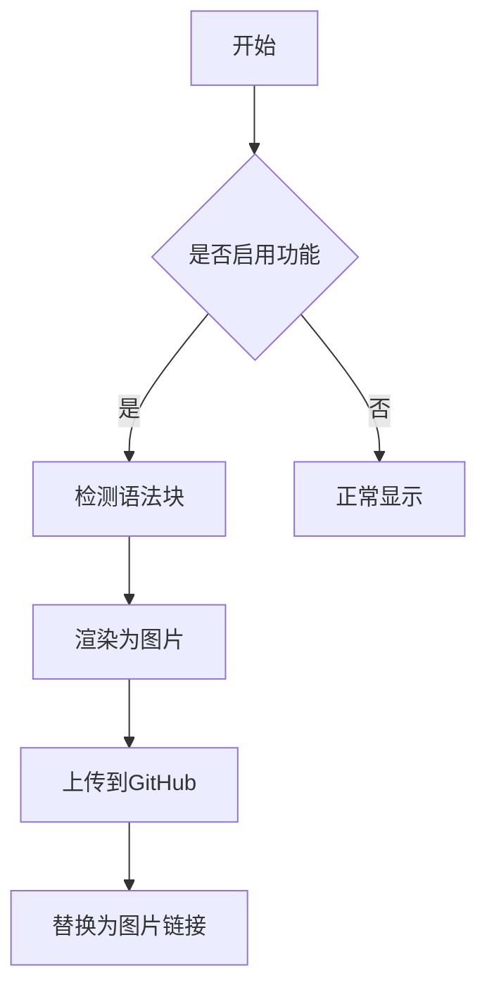

# 特殊语法块渲染功能使用指南

## 📖 功能概述

特殊语法块渲染功能可以将Markdown中的特殊语法块（代码块、Mermaid图表、数学公式、提示框等）自动转换为图片，并上传到GitHub图床，以提高跨平台兼容性。

## 🎯 支持的语法块类型

### 1. 代码块

```javascript
function hello() {
  console.log(`Hello, World!`)
}
```

### 2. Mermaid图表



### 3. 数学公式

$$
E = mc^2
$$

### 4. GitHub风格提示框

> [!NOTE]
> 这是一个提示信息

> [!WARNING]
> 这是一个警告信息

> [!TIP]
> 这是一个小贴士

## 🚀 如何使用

### 步骤1：启用功能

1. 打开编辑器右侧面板
2. 找到 "特殊语法块渲染" 部分
3. 点击开关启用功能

### 步骤2：编写内容

在编辑器中正常编写包含特殊语法块的Markdown内容。

### 步骤3：手动转图

使用新的手动转图功能，避免自动触发导致的响应慢问题：

#### 转图按钮位置

- 📍 **位置**：编辑器顶部工具栏，复制按钮组后面
- 🎯 **显示条件**：只有启用"特殊语法块渲染"功能后才显示
- 🔄 **状态切换**：点击可在"转图"和"原文"模式间切换

#### 使用方法

1. **编写内容** - 在编辑器中正常编写包含特殊语法块的Markdown
2. **点击转图** - 点击工具栏中的"转图"按钮
3. **等待处理** - 系统会自动检测并转换所有特殊语法块为图片
4. **查看结果** - 原始语法块被替换为图片，按钮变为"原文"
5. **切换回原文** - 再次点击按钮可切换回原始内容

#### 智能缓存机制

- ✅ **内容检测** - 系统会检测内容是否发生变化
- ✅ **缓存复用** - 内容未变化时直接使用缓存的图片
- ✅ **避免重复** - 不会重复生成和上传相同的图片
- ✅ **性能优化** - 显著提高后续切换速度

### 步骤4：查看结果

1. **处理过程**：

   - 系统检测到特殊语法块
   - 在浏览器控制台显示处理日志
   - 渲染语法块为高质量图片
   - 上传图片到GitHub仓库

2. **完成标志**：
   - 原始语法块被替换为图片
   - 图片正确显示内容
   - 控制台显示 "Image uploaded successfully"

## 🔧 操作说明

### 界面控制

#### 右侧面板功能

- **功能开关** - 启用/禁用特殊语法块渲染
- **GitHub配置显示** - 查看当前图床配置
- **连接测试按钮** - 测试GitHub API连接
- **语法块预览** - 显示当前文档中检测到的特殊语法块

#### 顶部工具栏功能

- **转图按钮** - 手动触发特殊语法块转换为图片
- **状态显示** - 按钮文字显示当前模式（"转图"或"原文"）
- **高亮状态** - 图片模式时按钮高亮显示

#### 状态指示

- **绿色徽章** - 功能已启用
- **灰色徽章** - 功能已禁用
- **数字徽章** - 显示检测到的语法块数量
- **按钮高亮** - 转图模式时按钮背景高亮

### 处理流程

```
编写Markdown → 点击转图按钮 → 检测语法块 → 渲染图片 → 上传GitHub → 替换链接 → 完成
     ↓              ↓              ↓           ↓          ↓          ↓         ↓
   正常编辑      手动触发        识别语法块    生成PNG    API上传    更新内容   显示图片
```

#### 缓存流程

```
再次点击转图 → 检查内容变化 → 使用缓存/重新生成 → 快速切换
     ↓              ↓                ↓              ↓
   用户操作      哈希对比          智能判断        提升性能
```

## 📋 注意事项

### 处理时间

- **首次渲染** - 可能需要5-10秒
- **后续渲染** - 利用缓存，速度更快
- **图片可访问** - 上传后立即可用

### 网络要求

- **稳定网络连接** - 用于上传图片到GitHub
- **GitHub API访问** - 确保能访问api.github.com
- **图床域名访问** - 确保能访问images.jieyu.ai

### 存储说明

- **存储位置** - GitHub仓库：zillionare/images
- **路径格式** - images/{年份}/{月份}/文件名.png
- **文件命名** - 类型-时间戳-随机字符.png
- **访问地址** - https://images.jieyu.ai/路径

## 🐛 故障排除

### 常见问题

#### 1. 图片不显示或显示空白

**可能原因**：

- GitHub token权限不足
- 网络连接问题
- 图片还在上传中

**解决方法**：

1. 检查GitHub token权限（需要Contents: Write）
2. 点击"测试GitHub连接"验证配置
3. 等待几秒钟后刷新页面
4. 查看浏览器控制台错误信息

#### 2. 403权限错误

**错误信息**：`Resource not accessible by personal access token`

**解决方法**：

1. 重新生成GitHub token
2. 确保选择了正确的权限：
   - ✅ repo (完整仓库权限) 或
   - ✅ Contents: Write + Metadata: Read
3. 更新.env.local文件中的token
4. 重启开发服务器

#### 3. CSS跨域错误

**错误信息**：`Not allowed to access cross-origin stylesheet`

**解决方法**：

- 这个错误不影响功能，图片仍会正常生成
- 如果影响渲染质量，可以尝试刷新页面

#### 4. 语法块未被检测

**可能原因**：

- 语法块格式不正确
- 功能未启用
- 缓存问题

**解决方法**：

1. 检查语法块格式是否正确
2. 确认功能已启用（右侧面板开关）
3. 手动刷新页面
4. 重新编辑语法块内容

## 📊 性能优化

### 缓存机制

- **内容缓存** - 相同内容的语法块会复用已生成的图片
- **避免重复** - 减少不必要的渲染和上传
- **提升速度** - 显著提高后续处理速度

### 最佳实践

- **批量编辑** - 完成所有编辑后再启用功能
- **网络稳定** - 在网络稳定时使用功能
- **适度使用** - 避免过多的语法块影响性能

## 🔍 调试信息

### 控制台日志

打开浏览器开发者工具（F12），在Console标签页可以看到详细的处理日志：

```
Starting GitHub image upload with config: ...
Generated filename: code-1234567890-abc123.png
Storage path: images/2024/06/code-1234567890-abc123.png
Uploading image to GitHub: ...
Image uploaded successfully: https://images.jieyu.ai/...
```

### 状态监控

- **成功** - 控制台显示绿色成功信息
- **警告** - 控制台显示黄色警告信息
- **错误** - 控制台显示红色错误信息，并有详细错误描述

---

## 📞 获取帮助

如果遇到问题：

1. 查看浏览器控制台的详细错误信息
2. 使用"测试GitHub连接"功能验证配置
3. 参考 `SETUP_INSTRUCTIONS.md` 进行配置检查
4. 确认GitHub token权限设置正确
