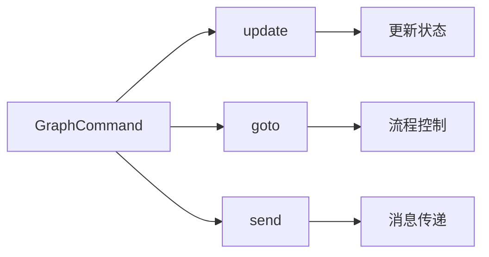
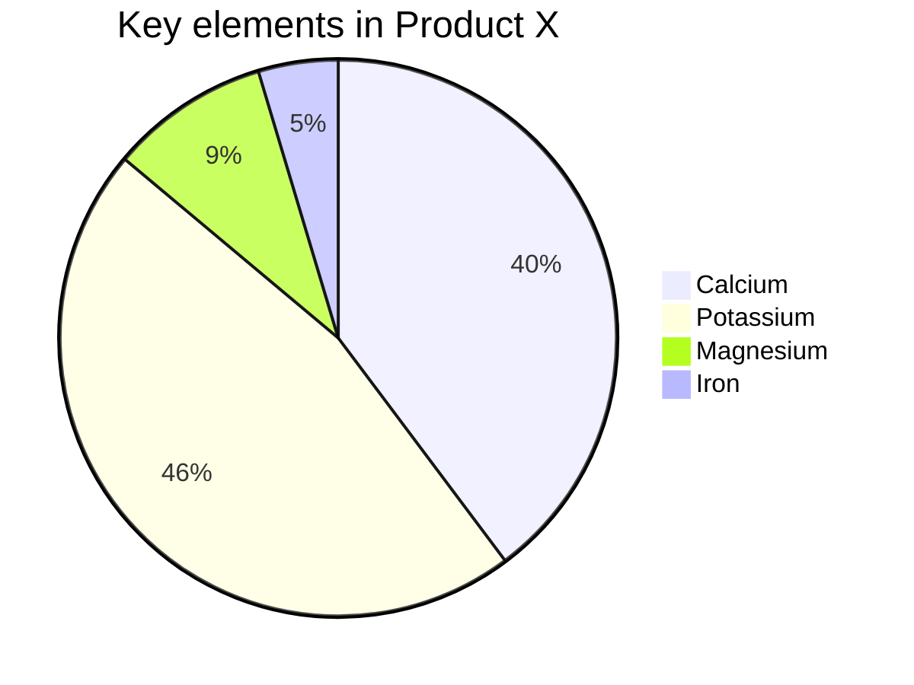
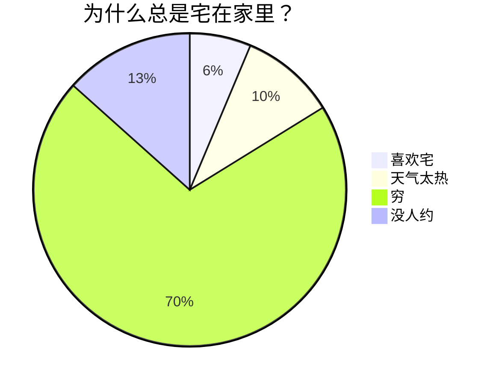
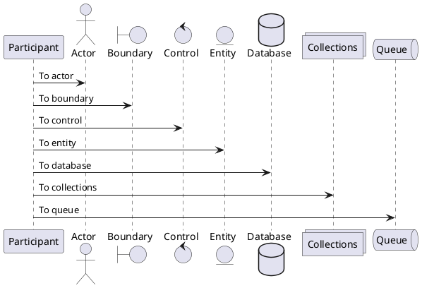

## 1. 欢迎使用 Marktwain！

Marktwain 是一款博文编辑工具。你可以使用 Markdown 及其增强语法来编辑博文，然后在不损失视觉效果的情况下，把文章发表到几乎任何平台上。

这意味着，你的博文中，可以包含**图表**、**警语**、**代码**、**公式**，它们可以发表到任何网站，无论这些网站是否支持其语法。

!!! info "致谢！"
  Marktwain 基于[Doocs/md](https://github.com/doocs/md) 开发。在其基础上，提供了 Admonition, 代码行号支持和转图功能，增强了转 PDF 功能。

如果你还不熟悉 Markdown 及其语法，请跳转[探索 Markdown 的奇妙世界](https://zillionare.github.io/marktwain/marktwain#markdown)。

### 1.1. Admonition

很多人很熟悉 Common Mark 的 Admonition。它们一方面用来强调、提示或者跳出文章主线，为读者提供更多的信息；另一方面，它们也使得文章的表达在视觉上更为活泼。

!!! info "Admonition 语法"
  这是一个 Admonition Info 信息块。它的语法是:
  ```md
  !!! {tag} "title"
      这是一个 Admonition Info 信息块。它的语法是:
  ```

一个 Admonition 由三个感叹号[!]引起，后面是它的 tag，然后分别是标题和内容。

目前支持的 Admonition tag 有 info, note, tip, example, attention, warning, abstract 等。以下是 Attention 一例：

!!! attention
  Admonition中可以不使用标题。如果要使用标题，请用一对引号将它们括起来。

### 1.2. 代码行号

截止2.0.4，[Doocs/md](https://github.com/doocs/md)缺少的一个功能是，代码没有行号。如果你需要代码行号，那么可以使用 **Marktwain**。

你可以在设置区（点击右上角的 ⚙️打开），找到代码行号的开关。

### 1.3. 转图功能

能将 Admonition、公式、代码和标题转成图片，是你使用 **Marktwain** 而不是其它同类软件的主要理由。在转图之后，再复制转图后的内容，就可以粘贴到公众号、知乎、知识星球、CSDN 等几乎所有网站，而保持几乎一致和视觉效果！

!!! tip
  如果是要发表到公众号，可无须转图，直接复制为公众号格式，再粘贴。

这是选择哪些特殊语法块需要转图：


如果有一些网站对这些语法支持得不太好，就可以选择将它们转换成图片，直接贴图过去。比如，知乎尽管支持代码的语法高亮，但它的样式太老了，而且在移动端上也不支持，这时候用图片来展现代码就很有用了。

说到知乎，它到现在还只允许两级标题，并且标题之间只能使用字体来区分。如果你希望有一个彩色、居中、带边框的标题怎么办? 这时候就可以使用转图功能，将标题条也转换为图片：


在你编辑完之后，点击转图，然后就可以复制转图后的内容，到其它网站上粘贴了：

)

!!! attention
  转图功能需要配置图床。doocs/md 已经提供了多个图床。但我们只测试了 github 图床。

要配置图床，请在菜单 编辑 > 上传图片 处进行设置，见下图：


下图显示了如何配置 github 图床：


### 1.4. 转PDF

[Doocs/md](https://github.com/doocs/md)原生支持转 PDF。但是，因为使用了跨域的 CSS，所以，在转 PDF 时，会丢失 Admonition样式、代码部分的背景和语法高亮效果及其它视觉效果。

如果你比较在意这些效果，可以先使用转图功能，然后切换到『转图后』标签页，再选择 文件 > 导出 PDF，此时导致的 PDF 就会包含全部样式。

## 2. 探索 Markdown 的奇妙世界

<div style="opacity: 0.01;width=10px" id="markdown"></div>

欢迎来到 Markdown 的奇妙世界！无论你是写作爱好者、开发者、博主，还是想要简单记录点什么的人，Markdown 都能成为你新的好伙伴。它不仅让写作变得简单明了，还能轻松地将内容转化为漂亮的网页格式。今天，我们将全面探讨 Markdown 的基础和进阶语法，让你在这个过程中充分享受写作的乐趣！

<a href="#marktwain-新功能">我是 Markdown高手！ 直接跳转到 Marktwain 新功能</a>

Markdown 是一种轻量级标记语言，用于格式化纯文本。它以简单、直观的语法而著称，可以快速地生成 HTML。Markdown 是写作与代码的完美结合，既简单又强大。

## 3. Markdown 基础语法

### 3.1. 标题：让你的内容层次分明

用 `#` 号来创建标题。标题从 `#` 开始，`#` 的数量表示标题的级别。

```markdown
# 一级标题

## 二级标题

### 三级标题

#### 四级标题
```

以上代码将渲染出一组层次分明的标题，使你的内容井井有条。

### 3.2. 段落与换行：自然流畅

Markdown 中的段落就是一行接一行的文本。要创建新段落，只需在两行文本之间空一行。

### 3.3. 字体样式：强调你的文字

- **粗体**：用两个星号或下划线包裹文字，如 `**粗体**` 或 `__粗体__`。
- _斜体_：用一个星号或下划线包裹文字，如 `*斜体*` 或 `_斜体_`。
- ~~删除线~~：用两个波浪线包裹文字，如 `~~删除线~~`。

这些简单的标记可以让你的内容更有层次感和重点突出。

### 3.4. 列表：整洁有序

- **无序列表**：用 `-`、`*` 或 `+` 加空格开始一行。
- **有序列表**：使用数字加点号（`1.`、`2.`）开始一行。

在列表中嵌套其他内容？只需缩进即可实现嵌套效果。

- 无序列表项 1
  1. 嵌套有序列表项 1
  2. 嵌套有序列表项 2
- 无序列表项 2

1. 有序列表项 1
2. 有序列表项 2

### 3.5. 链接与图片：丰富内容

- **链接**：用方括号和圆括号创建链接 `[显示文本](链接地址)`。
- **图片**：和链接类似，只需在前面加上 `!`，如 ``。


访问[匡醍量化](https://www.jieyu.ai)

轻松实现富媒体内容展示！

> 因微信公众号平台不支持除公众号内容以外的链接，故其他平台的链接，会呈现链接样式但无法点击跳转。

> 对于这些链接请注意明文书写，或点击左上角「格式->微信外链接转底部引用」开启引用，这样就可以在底部观察到链接指向。

另外，使用 `<,>` 语法可以创建横屏滑动幻灯片，支持微信公众号平台。建议使用相似尺寸的图片以获得最佳显示效果。

### 3.6. 引用：引用名言或引人深思的句子

使用 `>` 来创建引用，只需在文本前面加上它。多层引用？在前一层 `>` 后再加一个就行。

> 这是一个引用
>
> > 这是一个嵌套引用

这让你的引用更加富有层次感。

### 3.7. 代码块：展示你的代码

- **行内代码**：用反引号包裹，如 `code`。
- **代码块**：用三个反引号包裹，并指定语言，如：

```js
console.log(`Hello, Marktwain!`)
```

语法高亮让你的代码更易读。

### 3.8. 分割线：分割内容

用三个或更多的 `-`、`*` 或 `_` 来创建分割线。

---

为你的内容添加视觉分隔。

### 3.9. 表格：清晰展示数据

Markdown 支持简单的表格，用 `|` 和 `-` 分隔单元格和表头。

| 课程及预览                                                                                       | 说明                                                                                                                                               |
| ------------------------------------------------------------------------------------------------ | -------------------------------------------------------------------------------------------------------------------------------------------------- |
| [量化24课](http://ke.quantide.cn:8080/academy/login?preview=true&course=l24)                     | 课程涵盖了量化交易的全流程，即如何获取数据，如何考察数据的分布、关联性，因子和模式的发现和提取，如何编写策略、进行回测和评估，最终将策略接入实盘。 |
| [因子挖掘与机器学习策略](http://ke.quantide.cn:8080/academy/login?preview=true&course=fa)        | 本课面向决心以专业、严谨的态度研究量化策略的人。学完本课，您将具有4年以上经验的量化研究员同样的研究能力。                                          |
| [量化人的 Numpy 和 Pandas](https://www.jieyu.ai/articles/python/numpy%26pandas/01-introduction/) | 课程文本点击链接免费阅读。可运行代码和环境请联系我们。                                                                                             |

这样的表格让数据展示更为清爽！

> 手动编写标记太麻烦？我们提供了便捷方式。左上方点击「编辑->插入表格」，即可快速实现表格渲染。

## 4. Markdown 进阶技巧

### 4.1. LaTeX 公式：完美展示数学表达式

Markdown 允许嵌入 LaTeX 语法展示数学公式：

- **行内公式**：用 `$` 包裹公式，如 $E = mc^2$。
- **块级公式**：用 `$$` 包裹公式，如：

$$
\begin{aligned}
d_{i, j} &\leftarrow d_{i, j} + 1 \\
d_{i, y + 1} &\leftarrow d_{i, y + 1} - 1 \\
d_{x + 1, j} &\leftarrow d_{x + 1, j} - 1 \\
d_{x + 1, y + 1} &\leftarrow d_{x + 1, y + 1} + 1
\end{aligned}
$$

1. 列表内块公式 1

$$
\chi^2 = \sum \frac{(O - E)^2}{E}
$$

2. 列表内块公式 2

$$
\chi^2 = \sum \frac{(|O - E| - 0.5)^2}{E}
$$

这是展示复杂数学表达的利器！

### 4.2. Mermaid 流程图：可视化流程

Mermaid 是强大的可视化工具，可以在 Markdown 中创建流程图、时序图等。








这种方式不仅能直观展示流程，还能提升文档的专业性。

> 更多用法，参见：[Mermaid User Guide](https://mermaid.js.org/intro/getting-started.html)。

### 4.3. PlantUML 流程图：可视化流程

PlantUML 是强大的可视化工具，可以在 Markdown 中创建流程图、时序图等。



> 更多用法，参见：[PlantUML 主页](https://plantuml.com/zh/)。

### 4.4. Ruby 注音：注音标注

支持两种格式：

```md
1. [文字]{注音}
2. [文字]^(注音)
```

渲染效果如下：

[你好]{nǐ hǎo} [世界]{shì jiè}

支持四种分隔符： `・`（中点）、`．` (全角句点)、`。` (中文句号)、`-` (英文减号)

示例：

```md
[你好世界]{nǐ・hǎo・shì・jiè}
[小夜時雨]^(さ・よ・しぐれ)
```

[你好世界]{nǐ・hǎo・shì・jiè}
[小夜時雨]^(さ・よ・しぐれ)

当字符串数量与分隔符数量不匹配时，会自动匹配到最合适的分隔符。

```md
[小夜時雨]{さ・よ・しぐれ}
[小夜時雨]{さ・よ}
[小夜]{さ・よ・しぐれ}
[小夜時雨]{さ・よ・しぐれ・extra}
```

[小夜時雨]{さ・よ・しぐれ}
[小夜時雨]{さ・よ}
[小夜]{さ・よ・しぐれ}
[小夜時雨]{さ・よ・しぐれ・extra}

## 5. 结语

Markdown 是一种简单、强大且易于掌握的标记语言，通过学习基础和进阶语法，你可以快速创作内容并有效传达信息。无论是技术文档、个人博客还是项目说明，Markdown 都是你的得力助手。希望这篇内容能够带你全面了解 Markdown 的潜力，让你的写作更加丰富多彩！

现在，拿起 Markdown 编辑器，开始创作吧！探索 Markdown 的世界，你会发现它远比想象中更精彩！

## 6. 关于开发者

匡醍量化是 MarkTwain 的开发者。我们开设有《量化24课》、《因子挖掘与机器学习策略》和《量化人的Numpy和Pandas》等量化课程。

我们维护着以下开源软件：

- [Quantstats-Reloaded](https://github.com/zillionare/quantstats-reloaded)，一个量化策略指标分析库
- [Zigzag](https://github.com/zillionare/ZigZag)，一个重要的顶底检测工具。
- [MarkTwain](https://github.com/zillionare/marktwain/)，即您正在使用的这份软件。
- [Python Project Wizard](https://github.com/zillionare/python-project-wizard) Python 项目起手式创建工具。

---

<center>
    
</center>
