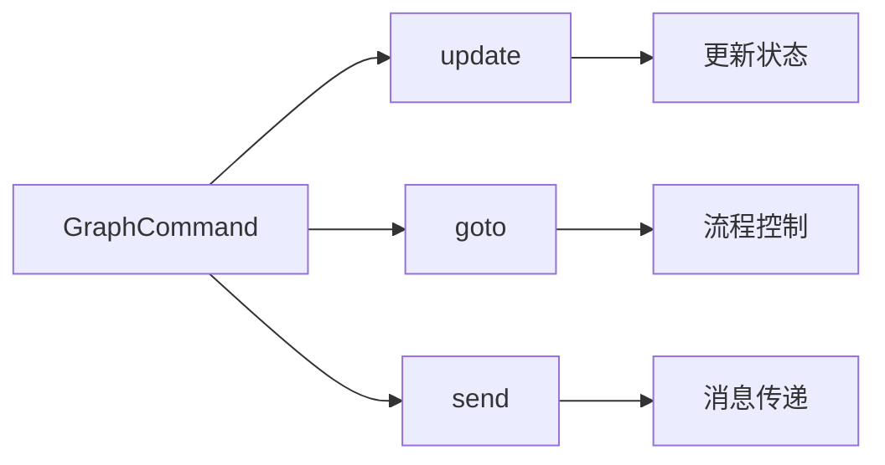
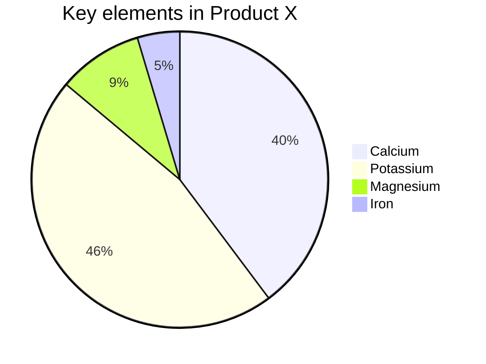
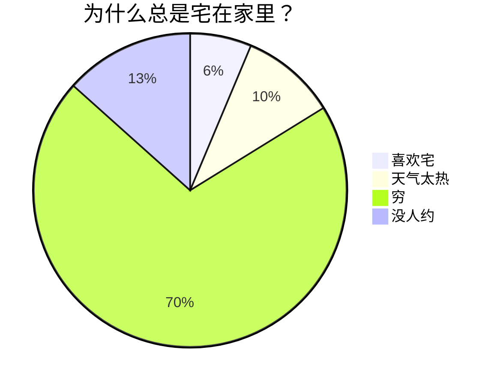

# 探索 Markdown 的奇妙世界

欢迎来到 Markdown 的奇妙世界！无论你是写作爱好者、开发者、博主，还是想要简单记录点什么的人，Markdown 都能成为你新的好伙伴。它不仅让写作变得简单明了，还能轻松地将内容转化为漂亮的网页格式。今天，我们将全面探讨 Markdown 的基础和进阶语法，让你在这个过程中充分享受写作的乐趣！

Markdown 是一种轻量级标记语言，用于格式化纯文本。它以简单、直观的语法而著称，可以快速地生成 HTML。Markdown 是写作与代码的完美结合，既简单又强大。

## Markdown 基础语法

### 1. 标题：让你的内容层次分明

用 `#` 号来创建标题。标题从 `#` 开始，`#` 的数量表示标题的级别。

```markdown
# 一级标题

## 二级标题

### 三级标题

#### 四级标题
```

以上代码将渲染出一组层次分明的标题，使你的内容井井有条。

### 2. 段落与换行：自然流畅

Markdown 中的段落就是一行接一行的文本。要创建新段落，只需在两行文本之间空一行。

### 3. 字体样式：强调你的文字

- **粗体**：用两个星号或下划线包裹文字，如 `**粗体**` 或 `__粗体__`。
- _斜体_：用一个星号或下划线包裹文字，如 `*斜体*` 或 `_斜体_`。
- ~~删除线~~：用两个波浪线包裹文字，如 `~~删除线~~`。

这些简单的标记可以让你的内容更有层次感和重点突出。

### 4. 列表：整洁有序

- **无序列表**：用 `-`、`*` 或 `+` 加空格开始一行。
- **有序列表**：使用数字加点号（`1.`、`2.`）开始一行。

在列表中嵌套其他内容？只需缩进即可实现嵌套效果。

- 无序列表项 1
  1. 嵌套有序列表项 1
  2. 嵌套有序列表项 2
- 无序列表项 2

1. 有序列表项 1
2. 有序列表项 2

### 5. 链接与图片：丰富内容

- **链接**：用方括号和圆括号创建链接 `[显示文本](链接地址)`。
- **图片**：和链接类似，只需在前面加上 `!`，如 ``。

[访问 Doocs](https://github.com/doocs)


轻松实现富媒体内容展示！

> 因微信公众号平台不支持除公众号内容以外的链接，故其他平台的链接，会呈现链接样式但无法点击跳转。

> 对于这些链接请注意明文书写，或点击左上角「格式->微信外链接转底部引用」开启引用，这样就可以在底部观察到链接指向。

另外，使用 `<,>` 语法可以创建横屏滑动幻灯片，支持微信公众号平台。建议使用相似尺寸的图片以获得最佳显示效果。

### 6. 引用：引用名言或引人深思的句子

使用 `>` 来创建引用，只需在文本前面加上它。多层引用？在前一层 `>` 后再加一个就行。

> 这是一个引用
>
> > 这是一个嵌套引用

这让你的引用更加富有层次感。

### 7. 代码块：展示你的代码

- **行内代码**：用反引号包裹，如 `code`。
- **代码块**：用三个反引号包裹，并指定语言，如：

```js
console.log("Hello, Doocs!");
```

语法高亮让你的代码更易读。

### 8. 分割线：分割内容

用三个或更多的 `-`、`*` 或 `_` 来创建分割线。

---

为你的内容添加视觉分隔。

### 9. 表格：清晰展示数据

Markdown 支持简单的表格，用 `|` 和 `-` 分隔单元格和表头。

| 项目人员                                    | 邮箱                   | 微信号       |
| ------------------------------------------- | ---------------------- | ------------ |
| [yanglbme](https://github.com/yanglbme)     | contact@yanglibin.info | YLB0109      |
| [YangFong](https://github.com/YangFong)     | yangfong2022@gmail.com | yq2419731931 |
| [thinkasany](https://github.com/thinkasany) | thinkasany@gmail.com   | thinkasany   |

这样的表格让数据展示更为清爽！

> 手动编写标记太麻烦？我们提供了便捷方式。左上方点击「编辑->插入表格」，即可快速实现表格渲染。

## Markdown 进阶技巧

### 1. LaTeX 公式：完美展示数学表达式

Markdown 允许嵌入 LaTeX 语法展示数学公式：

- **行内公式**：用 `$` 包裹公式，如 $E = mc^2$。
- **块级公式**：用 `$$` 包裹公式，如：

$$
\begin{aligned}
d_{i, j} &\leftarrow d_{i, j} + 1 \\
d_{i, y + 1} &\leftarrow d_{i, y + 1} - 1 \\
d_{x + 1, j} &\leftarrow d_{x + 1, j} - 1 \\
d_{x + 1, y + 1} &\leftarrow d_{x + 1, y + 1} + 1
\end{aligned}
$$

1. 列表内块公式 1

  $$
  \chi^2 = \sum \frac{(O - E)^2}{E}
  $$
    
2. 列表内块公式 2

  $$
  \chi^2 = \sum \frac{(|O - E| - 0.5)^2}{E}
  $$


这是展示复杂数学表达的利器！

### 2. Mermaid 流程图：可视化流程

Mermaid 是强大的可视化工具，可以在 Markdown 中创建流程图、时序图等。








这种方式不仅能直观展示流程，还能提升文档的专业性。

> 更多用法，参见：[Mermaid User Guide](https://mermaid.js.org/intro/getting-started.html)。

### 3. Admonition 提示框：突出重要信息

除了传统的引用块，我们还支持两种风格的提示框语法：

#### GitHub 风格的 Alerts

> [!NOTE]
> 这是一个 GitHub 风格的提示框，用于显示重要信息。

> [!TIP]
> 这是一个小贴士，提供有用的建议。

> [!IMPORTANT]
> 这是重要信息，需要特别注意。

> [!WARNING]
> 这是警告信息，提醒用户注意潜在问题。

> [!CAUTION]
> 这是危险警告，提醒用户谨慎操作。

#### CommonMark 风格的 Admonitions

!!! note "自定义标题"
    这是一个 CommonMark 风格的提示框，支持自定义标题。
    可以包含多行内容，非常适合展示详细信息。

!!! tip
    这是一个没有自定义标题的小贴士。
    系统会自动使用类型名称作为标题。

!!! important "重要提醒"
    这种语法更加灵活，支持更复杂的内容结构。

    - 可以包含列表
    - 可以包含代码
    - 可以包含其他 Markdown 元素

!!! warning
    警告信息同样支持 CommonMark 语法。

!!! caution "危险操作"
    请谨慎执行以下操作，可能会导致数据丢失。

#### 更多 Admonition 类型

我们支持更多的 admonition 类型：

!!! question "常见问题"
    这是一个问题类型的提示框，适合展示常见问题。

!!! hint "小贴士"
    这是一个提示类型，用于提供有用的建议和技巧。

!!! example "示例代码"
    这是示例类型，适合展示代码示例和演示。

    ```javascript
    console.log('Hello, World!');
    ```

!!! abstract "摘要"
    这是摘要类型，适合展示文档摘要和概述信息。

#### Admonition 结束条件

CommonMark admonition 有两种结束方式：

!!! tip "方式一：两个连续空行"
    这个 admonition 会在遇到两个连续空行时结束。
    这行还在 admonition 内部。


这段文字在两个空行后，已经在 admonition 外面了。

!!! note "方式二：HTML 注释标签"
    这个 admonition 会在遇到匹配的 HTML 注释时结束。
    这行还在 admonition 内部。
<!--note-->

这段文字在 HTML 注释后，已经在 admonition 外面了。

两种语法都能很好地突出重要信息，让你的文档更加专业和易读！

## 结语

Markdown 是一种简单、强大且易于掌握的标记语言，通过学习基础和进阶语法，你可以快速创作内容并有效传达信息。无论是技术文档、个人博客还是项目说明，Markdown 都是你的得力助手。希望这篇内容能够带你全面了解 Markdown 的潜力，让你的写作更加丰富多彩！

现在，拿起 Markdown 编辑器，开始创作吧！探索 Markdown 的世界，你会发现它远比想象中更精彩！

#### 推荐阅读

- [阿里又一个 20k+ stars 开源项目诞生，恭喜 fastjson！](https://mp.weixin.qq.com/s/RNKDCK2KoyeuMeEs6GUrow)
- [刷掉 90% 候选人的互联网大厂海量数据面试题（附题解 + 方法总结）](https://mp.weixin.qq.com/s/rjGqxUvrEqJNlo09GrT1Dw)
- [好用！期待已久的文本块功能究竟如何在 Java 13 中发挥作用？](https://mp.weixin.qq.com/s/kalGv5T8AZGxTnLHr2wDsA)
- [2019 GitHub 开源贡献排行榜新鲜出炉！微软谷歌领头，阿里跻身前 12！](https://mp.weixin.qq.com/s/_q812aGD1b9QvZ2WFI0Qgw)

---

<center>
    
</center>
