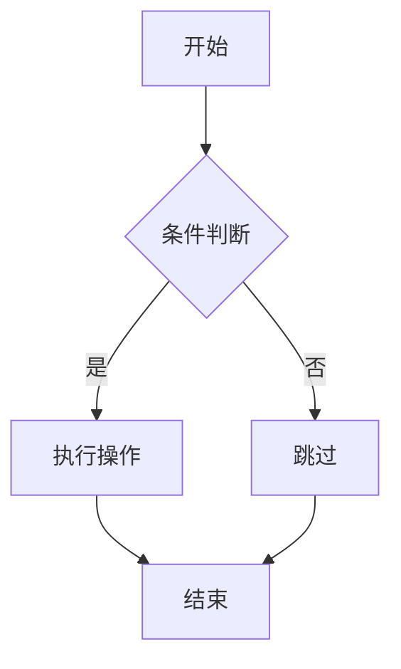

# CommonMark Admonition 测试

## 基本语法测试

!!! note
这是一个note类型的admonition块。
支持多行内容。

!!! tip "自定义标题"
这是一个带自定义标题的tip块。
可以包含**粗体**和*斜体*文本。

!!! warning
这是一个warning类型的警告块。
用于显示重要的警告信息。

!!! info
这是一个info类型的信息块。
用于显示一般信息。

!!! success
这是一个success类型的成功块。
用于显示成功状态。

!!! failure
这是一个failure类型的失败块。
用于显示失败状态。

## 嵌套内容测试

!!! example "代码示例"
这个块包含代码：

    ```python
    def hello_world():
        print("Hello, World!")
    ```

    还可以包含列表：
    - 项目1
    - 项目2
    - 项目3

!!! quote "引用块" > 这是一个嵌套的引用 > 在admonition块内部

    还可以包含链接：[GitHub](https://github.com)

## 测试转图功能

下面的内容应该可以被转换为图片：

```python
# 这是一个Python代码块
def fibonacci(n):
    if n <= 1:
        return n
    return fibonacci(n-1) + fibonacci(n-2)

print(fibonacci(10))
```



!!! important "重要提示"
这个admonition块也应该可以转换为图片。
包含多行内容和格式化文本。
